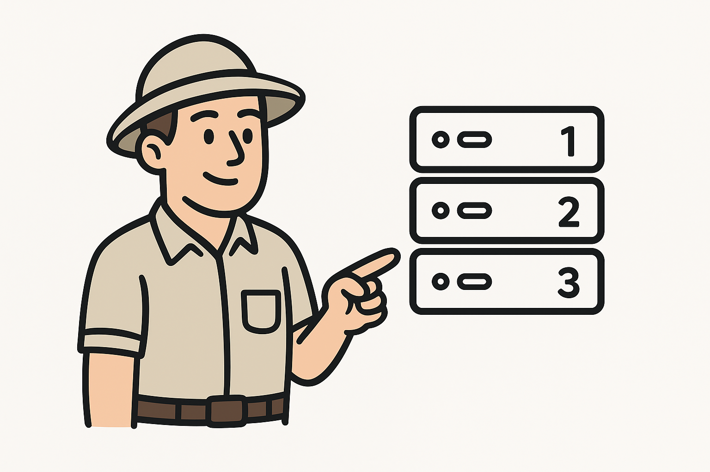

# Example Sequence Server Zookeeper
Sample repo to create sequenced servers by using ZooKeeper

- [Nice Medium post that helped me to understand what ZooKeeper is](https://bikas-katwal.medium.com/zookeeper-introduction-designing-a-distributed-system-using-zookeeper-and-java-7f1b108e236e)
- [Nice Zookeeper guide](https://www.tutorialspoint.com/zookeeper/zookeeper_quick_guide.htm)
- [ZooKeeper Docker Image](https://hub.docker.com/_/zookeeper)
- [ZooKeeper Dotnet Library](https://github.com/shayhatsor/zookeeper)




## Goal

The goal of this sample project is to be able to have many servers with a unique sequence number. This challenge came to my mind after during a coding interview I was asked to design an ID generator. My approach was to use the [Tweeter Snowflake Id Algorithm](https://en.wikipedia.org/wiki/Snowflake_ID). The interviewer asked "But how are going to assign the id to the servers, those are automatically generated" I said, "Well let's use something like ZooKeeper" (but to be honest I had no idea how it works). And then they asked "But, for example, what happens if the servers go down and then recover, the id is the same, or it is different?"... I had no idea, I didn't know exactly how it works. So I decided to try it, after gaining a bit more knowledge about how docker works, it is nice to try it.

We have a docker-compose with 2 services. One is for ZooKeeper and the other one is for the SequenceNode API app. The code is very basic, without tests (only manual), please don't judge me because of that!

We can create many instances of SequenceNode and see what happens!!!


## Test using Docker

### First run the ZooKeeper container

1. cd `./code`
2. run `docker compose up -d zookeeper`

Now we have a simple ZooKeeper instance running.

### (optional) Let's test the ZooKeeper instance by doing:

1. `docker container ls` or `docker ps`
2. find the docker container ID and then connect...
3. run `docker exec -it <container-id> zkCli.sh` and should be inside the ZooKeeper command line as a client
4. run `ls /` to try it

### Run the docker instances of the node servers.

The first step is to build the image.

1. Go to `cd ./code/SequenceNode`
2. Run the build image command: `docker image build -t sequencenode --target prod . `

Then create the containers like this:

```bash
  docker run -p 5001:80 --name sequencenode1 --network code_default -d sequencenode
  docker run -p 5002:80 --name sequencenode2 --network code_default -d sequencenode
  docker run -p 5003:80 --name sequencenode3 --network code_default -d sequencenode
  docker run -p 5004:80 --name sequencenode4 --network code_default -d sequencenode
```

NOTE: this network should be created by default when making the compose up command. If it has a different name change these commands.

### Test it!

Feel free to open a terminal or a browser tab to test it.

To test in on a terminal just run a `curl` command:

```bash
curl http://localhost:500x/sequence
```

To test on a browser just go to `http://localhost:500x/swagger` or directly to `http://localhost:500x/sequence`

Test:
1. Get sequence for 1, 2 and 3
2. Then stop 2 (`docker container stop sequencenode2`)
3. Then get the sequence for 4 (Should get the number 2 since it is free now!)
4. Then start 2 again (`docker container start sequencenode2`)
5. Get the sequence for 2, it should be 4 now.

If we test stopping the zookeeper container. All sequence requests are going to fail. But if start it again, are going to work again. Just a strange behavior: in this scenario, transient znodes are not deleted, so the new sequences are going to start after the last inserted (`5` in this case).

### Test it by running docker-compose up

- Change the number of replicas from 1 to 4 in the `docker-compose.yml` file
- Run `docker compose up -d`. Now all the replicas should be up. This is harder to test because there is no way to access directly from the host because we are not exposing ports.
- First approach (connect directly to containers):
- - Make a `docker ps` to the the container IDs and then
- - Connect to the containers `docker exec -it ecb sh` (`ecb` is the container id)
- - And then query the sequence id `wget -qO- http://localhost/sequence`
- Second approach (magic one! Create another container and use the load balancer!):
- - Just run a new container and attach it to the same network by doing `docker run -it --rm --network code_default alpine sh`
- - And then just repeat `wget -qO- http://node/sequence` as many times as you want. You could get a different number each time. That is the magic of load balancing.
