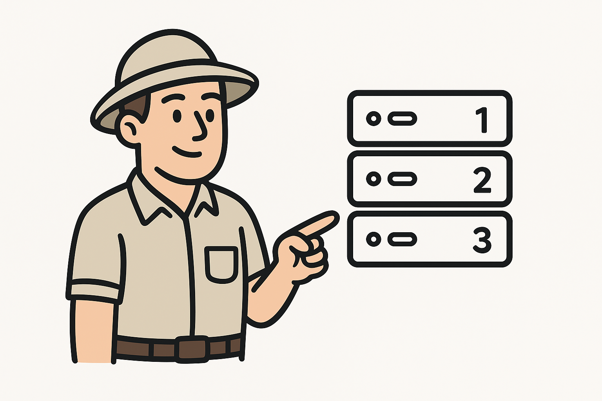

# Building a Distributed Sequence Generator with ZooKeeper and C\#




## 1. Goal and Motivation

This demo project explores how to assign unique, dynamic sequence numbers to multiple server instances in a distributed environment, inspired by challenges that surface when designing things like global ID generators (e.g., Twitter’s Snowflake). As described in the project’s README, the scenario began as a typical interview problem: how do you ensure each server instance receives (and keeps) a unique ID, especially if instances are started, stopped, or restarted?

ZooKeeper is leveraged here to coordinate between all node servers, and to manage these lifecycle and uniqueness challenges in a robust, automatic way.

## References:
-  [Demo Github Repo](https://github.com/rulyotano/example-sequence-server-zookeeper)
- [Nice Medium post that helped me to understand what ZooKeeper is](https://bikas-katwal.medium.com/zookeeper-introduction-designing-a-distributed-system-using-zookeeper-and-java-7f1b108e236e)
- [Nice Zookeeper guide](https://www.tutorialspoint.com/zookeeper/zookeeper_quick_guide.htm)
- [ZooKeeper Docker Image](https://hub.docker.com/_/zookeeper)
- [ZooKeeper Dotnet Library](https://github.com/shayhatsor/zookeeper)


## 2. What is ZooKeeper, and How Does It Help?

**ZooKeeper** is a distributed coordination service. It can be used to manage configuration, naming, synchronization, and group services for large distributed systems. ZooKeeper organizes its data in a file-system-like hierarchy called "znodes." These znodes can store both data and metadata, and are kept in sync across the ZooKeeper ensemble.

### Key features

- **Ephemeral znodes:** These are znodes that exist as long as the client that created them maintains its connection—perfect for live service registration.
- **Watcher mechanism:** Clients can set watches to be notified about specific changes (e.g., a znode disappearing, data changing, or children being added or removed). This enables real-time ("live") updates and coordination between services.

**In this demo:**
- Each server instance tries to claim an ID by creating a numbered ephemeral znode under a parent `/sequence` node.
- If an instance dies or disconnects, its znode is automatically deleted, freeing up its number for future instances.
- New instances dynamically see available ("free") numbers and claim the lowest unused one.

## 3. Using ZooKeeper znodes to Track Instance IDs (Walkthrough of the Demo)

The core logic of assigning and tracking instance sequence numbers lives in the [`ZookeeperDistributedConfiguration`](code/SequenceNode/Infrastructure/Zoo/ZookeeperDistributedConfiguration.cs)  class.

```
<script src="https://gist.github.com/rulyotano/d03cfb7be4f7c59b40685a0a458be020.js"></script>
```


### Main Elements of the Implementation

- **Sequence Node Initialization:**  
  The parent `/sequence` znode is created if it doesn't exist.
- **Assigning IDs:**  
  Each server, on startup, looks for the lowest available number (by checking the children of `/sequence`), and tries to create an ephemeral znode like `/sequence/1`, `/sequence/2`, etc.
- **Ephemeral znodes:**  
  The use of `CreateMode.EPHEMERAL` ensures znodes are removed if a server disconnects, making numbers immediately reusable.
- **Live Coordination:**  
  When servers join or leave, the list of children under `/sequence` is updated live, so every instance knows which IDs are in use and which are free.
- **Connection Handling:**  
  Robust connection and reconnection logic (with retries and watcher callbacks) is implemented using ZooKeeper’s watcher/event system.

#### Example: ID Allocation Logic

```csharp
private async Task AssignSequenceIfNoAsync(CancellationToken cancellationToken)
{
  await InitializeAsync();
  if (IsSequenceAssigned()) return;
  var created = false;
  var triesLeft = 5;

  while (!created && triesLeft > 0)
  {
    var assignedSequenceNumbers = await GetAssignedSequenceNumbersAsync(cancellationToken);
    if (assignedSequenceNumbers.Count == 0 || assignedSequenceNumbers[0] != FirstSequence)
    {
      _sequenceNumber = FirstSequence;
    }
    _sequenceNumber = FindFirstFreeSequenceNumber(assignedSequenceNumbers);

    created = await AssignSequenceNumberAsync(_sequenceNumber, cancellationToken);
    triesLeft--;
  }
}
```

### Summary of C\# Implementation

- **Minimalist and Direct:**  
  The approach is intentionally simple, focusing on basic ZooKeeper primitives rather than advanced recipes or third-party libraries.
- **Classes of Interest:**  
  - `ZookeeperDistributedConfiguration`: Main logic for sequence assignment.
  - `ZookeeperConnection`: Handles the ZooKeeper client, connection retries, and reacting to ZooKeeper events.
  - `ZookeeperWatcher`: Implements event/subscription logic to handle live updates triggered by ZooKeeper state changes.

---

This demo exemplifies a hands-on, minimal setup for learning about ZooKeeper, distributed coordination, and ephemeral resource assignment using znodes. It also illustrates how even a basic C# implementation can make use of these powerful coordination patterns.